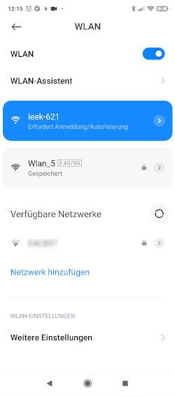
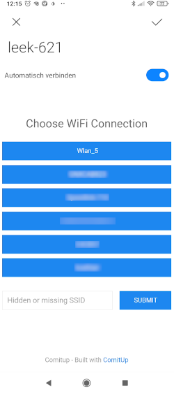
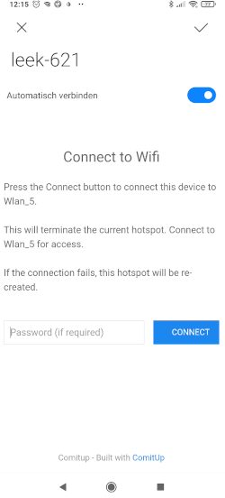

# Use a leek

## Connect the leek-box to your wifi

> This requires `comitup` [see build guide](Build.md) to be correctly configured.

You should see a wifi called `leek-123` (with `123` being a random number).

1. Connect to the wifi\
\
Your device should automatically open a web-page (like a public hotspot normally does) where you can setup the wifi connection.

1. Select a wifi from the provided list\

1. Enter the password of the selected wifi\

1. The Raspberry PI should now be connected to your private wifi.